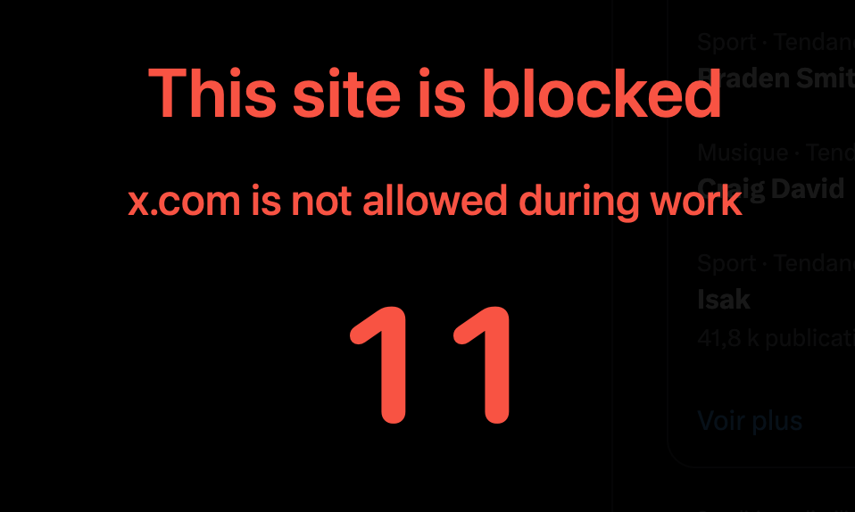

# Refocus



You open Chrome to check one thing. Two hours later you're deep in YouTube/Twitter/Reddit.

Refocus stops this. Start a work session, and if you drift to a distracting site or app, you get a warning. Ignore it, and a full-screen overlay blocks everything. Enable hard mode, and Chrome closes entirely.

No willpower required. The app enforces it for you.

## How it works


1. Start a session from the menu bar
2. Work normally
3. Open a distracting site or app → warning overlay appears
4. Close the distraction → overlay disappears
5. Ignore the warning → screen goes red, Chrome closes (hard mode)

## What gets blocked

- **Websites:** YouTube, Twitter/X, Reddit, Instagram, Facebook, TikTok, Netflix, Discord, Hacker News
- **Browsers:** Safari, Firefox, Arc, Edge, Brave, Opera, Vivaldi
- **Apps:** Steam, Spotify, Discord, Netflix, games, social media apps

## Setup

```bash
./scripts/reinstall_refocus_app.sh
./scripts/install_native_host.sh
```

Then load the Chrome extension from `chrome://extensions` → Load unpacked → `chrome_extension/`

## Privacy

Everything stays on your Mac. No accounts, no cloud, no tracking.
